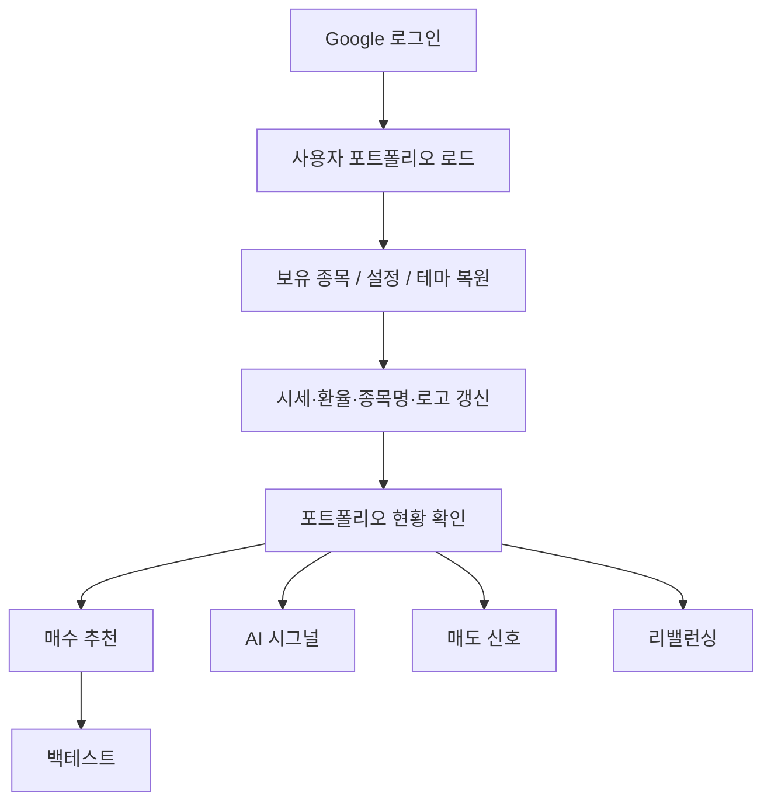

# QPM Alpha

QPM Alpha는 적립식 투자자를 위한 웹 기반 포트폴리오 관리 애플리케이션입니다.  
보유 종목의 평가금액, 주간 매수 추천, AI 기반 뉴스 시그널, 매도 신호, 리밸런싱, 백테스트를 하나의 화면 흐름에서 제공합니다.

---

## Overview

QPM Alpha는 사용자가 보유한 종목을 기준으로 매주 어떤 종목을 얼마나 매수할지 계산하고, 정기적으로 점검해야 할 매도 후보와 리밸런싱 대상을 보여줍니다.

주요 목표는 다음과 같습니다.

- 포트폴리오 현황을 빠르게 파악
- 데이터 기반 주간 매수 금액 산출
- 뉴스와 애널리스트 데이터를 활용한 AI 시그널 확인
- 과거 성과와 벤치마크 비교
- 리밸런싱과 매도 점검을 직관적으로 지원

---

## Key Features

| 영역 | 설명 |
|---|---|
| 포트폴리오 관리 | 보유 종목, 수량, 평가금액, 원화/달러 총액 확인 |
| 기업 로고 표시 | 종목 카드와 주요 표에서 기업 로고 표시 |
| 데이터 업데이트 | 시세 갱신, 종목명 조회, 자동 갱신 설정 |
| AI 시그널 | 보유 종목의 뉴스와 애널리스트 데이터를 AI가 요약 |
| 매수 추천 | 모멘텀과 변동성 기반 주간 매수 금액 계산 |
| 매도 신호 | 최근 1개월 일별 랭킹을 기반으로 매도 후보와 관찰 종목 분류 |
| 리밸런싱 | 현재 비중과 목표 비중 차이를 계산해 추가 매수/매도 금액 제시 |
| 백테스트 | QPM Alpha 전략과 벤치마크의 과거 성과 비교 |
| 테마 저장 | 라이트/다크 모드 설정을 사용자별로 저장 |
| 모바일 최적화 | 작은 화면에서도 평가금액, 버튼, 차트가 읽히도록 조정 |

---

## Product Flow



---

## Tabs

| 탭 | 제공 기능 |
|---|---|
| 포트폴리오 | 총 평가금액, 보유 종목 리스트, 종목 추가/삭제, 수량 편집, 캡처 이미지 기반 업데이트 |
| AI 시그널 | 종목별 AI 요약, 뉴스, 애널리스트 데이터, 상승/하락 필터 |
| 매수 추천 | 주간 투자금 기준 추천 금액, 추천 수량, 목표 비중 |
| 백테스트 | 평가금액/누적수익률 차트, XIRR, MDD, 변동성, Sharpe |
| 매도 신호 | Top N 진입률 기반 매도 후보 및 관찰 종목 |
| 리밸런싱 | 목표 비중 대비 더 사야 할 금액과 더 팔아야 할 금액 |
| 설정 | 투자금, 벤치마크, API 키, 데이터 가져오기/내보내기 |

---

## Investment Logic

QPM Alpha는 시장 국면에 따라 모멘텀과 변동성 점수를 다르게 반영합니다.

### Factor Inputs

| 팩터 | 설명 |
|---|---|
| 모멘텀 | 21일, 63일, 126일, 252일 가격 흐름을 가중 반영 |
| 변동성 역수 | 60일 수익률 표준편차의 역수를 사용 |
| 시장 국면 | QQQ와 200일 이동평균을 비교해 강세/약세 판단 |

### Regime Weights

| 시장 국면 | 모멘텀 | 변동성 역수 |
|---|---:|---:|
| 강세장 | 70% | 30% |
| 약세장 | 40% | 60% |

### Weight Calculation

```text
alpha = z_momentum * momentum_weight
      + z_inverse_volatility * volatility_weight

weight = relu(alpha)
weight = normalize(weight)
weight = cap_each_position_at_25_percent(weight)
```

---

## Data Storage

| 항목 | 저장 방식 |
|---|---|
| 포트폴리오 | Supabase 우선, 로컬 실행 시 JSON fallback |
| 사용자 설정 | 포트폴리오 데이터와 함께 저장 |
| 다크모드 | 사용자 설정으로 저장 |
| API 키 | 암호화 후 저장 |
| AI 시그널 캐시 | 사용자와 날짜 기준으로 저장 |

---

## Local Setup

```bash
git clone https://github.com/mavro7910/quant_portfolio_web.git
cd quant_portfolio_web
pip install -r requirements.txt
streamlit run app.py
```

Supabase 설정이 없으면 로컬 JSON 파일에 포트폴리오가 저장됩니다.

### Optional `.streamlit/secrets.toml`

```toml
SUPABASE_URL = "https://xxxx.supabase.co"
SUPABASE_KEY = "eyJhbGci..."
ES = "random_string_32chars_or_more"

[auth]
redirect_uri = "http://localhost:8501/oauth2callback"
cookie_secret = "random_string_32chars_or_more"

[auth.google]
client_id = "xxxx.apps.googleusercontent.com"
client_secret = "GOCSPX-xxxx"
server_metadata_url = "https://accounts.google.com/.well-known/openid-configuration"
```

---

## Supabase Schema

```sql
create table portfolios (
    uid        text primary key,
    data       jsonb not null,
    updated_at timestamp with time zone default now()
);

create table user_secrets (
    uid        text primary key,
    s          text not null,
    updated_at timestamp with time zone default now()
);

create table signal_cache (
    uid         text,
    cache_date text,
    data       jsonb not null,
    updated_at timestamp with time zone default now(),
    primary key (uid, cache_date)
);
```

---

## Project Structure

```text
quant_portfolio_web/
├── app.py
├── requirements.txt
├── assets/
│   └── icon.png
├── core/
│   ├── data.py
│   ├── portfolio.py
│   ├── secrets_store.py
│   └── strategy.py
├── tabs/
│   ├── tab_portfolio.py
│   ├── tab_ai_signal.py
│   ├── tab_buyrec.py
│   ├── tab_backtest.py
│   ├── tab_sell_signal.py
│   ├── tab_rebalance.py
│   └── tab_settings.py
└── utils/
    ├── ai_client.py
    ├── plotly_theme.py
    ├── styles.py
    └── ui.py
```

---

## Dependencies

| Package | Version |
|---|---|
| `streamlit` | `1.56.0` |
| `yfinance` | `>=1.2.0` |
| `pandas` | `>=2.2.0,<3.0` |
| `numpy` | `>=1.26.0,<2.1` |
| `plotly` | `>=5.22.0` |
| `scipy` | `>=1.13.0` |
| `Pillow` | `>=10.3.0` |
| `requests` | `>=2.32.0` |
| `supabase` | `>=2.0.0` |
| `authlib` | `1.6.11` |
| `google-generativeai` | `>=0.8.0` |
| `cryptography` | `>=42.0.0` |

---

## Update History

### Current

- UI를 단일 페이지 앱 흐름에 맞게 재정리
- 라이트/다크 모드 지원 및 사용자별 테마 저장
- 모바일 포트폴리오 카드에서 평가금액 표시 개선
- 기업 로고를 포트폴리오, AI 시그널, 매수 추천, 매도 신호, 리밸런싱에 적용
- 보유 종목 리스트를 평가금액 기준으로 정렬
- 포트폴리오 더보기/접기 버튼 중앙 정렬
- 데이터 업데이트 컨트롤을 포트폴리오 탭에 직접 노출
- 매도 신호 요약 카드와 히트맵 디자인 개선
- 백테스트 차트 레이블 위치 개선
- README를 제품 소개 형식으로 재작성

### Previous

- Google OAuth 로그인 지원
- Supabase 기반 포트폴리오 저장
- Gemini 기반 AI 시그널
- 캡처 이미지 기반 포트폴리오 업데이트
- XIRR 기반 백테스트 성과 요약
- 매도 신호 및 리밸런싱 탭 추가

---

## Disclaimer

이 애플리케이션은 정보 제공 및 교육 목적의 도구입니다. 특정 종목의 매수 또는 매도를 권유하지 않습니다. 모든 투자 판단과 책임은 사용자에게 있으며, 과거 성과가 미래 수익을 보장하지 않습니다.

---

MIT License
