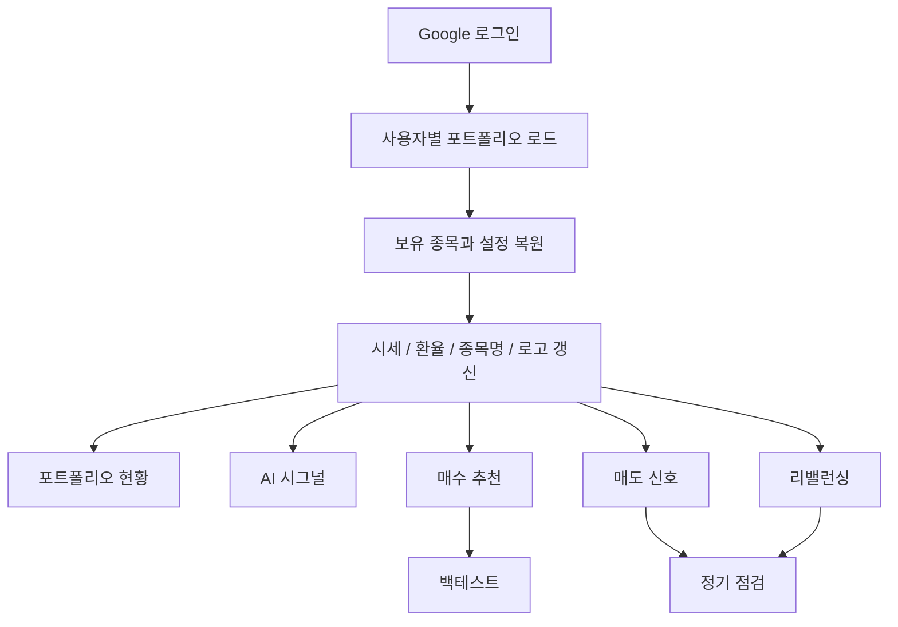
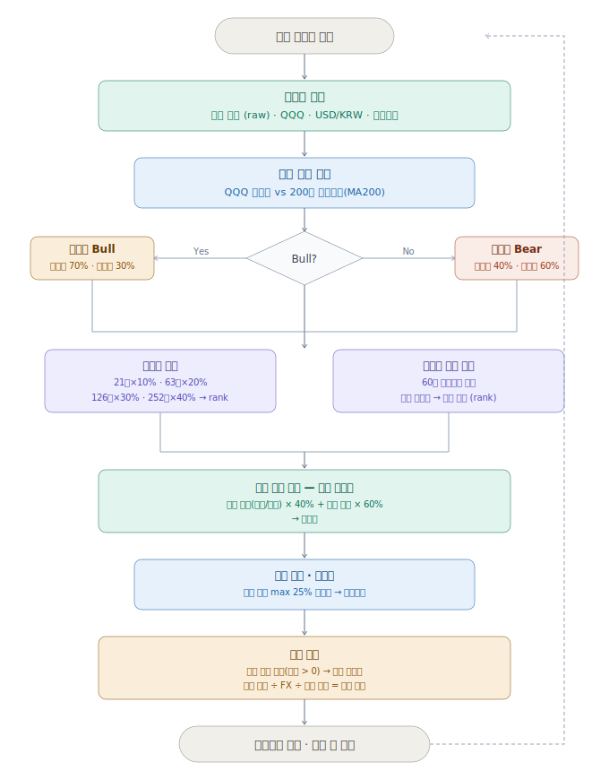
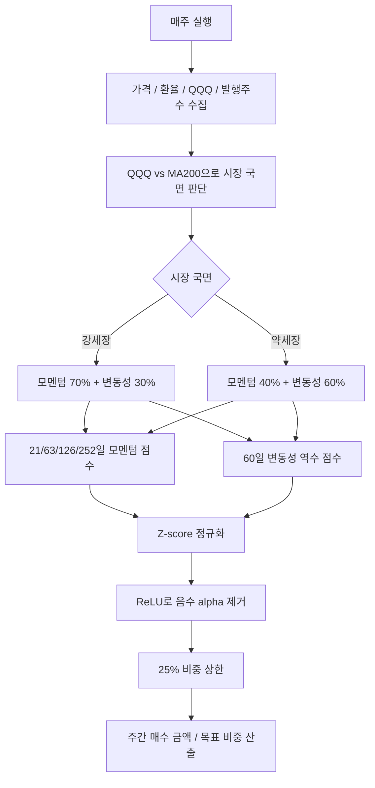
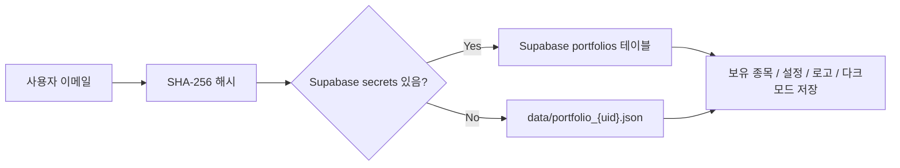

# QPM Alpha

> 주간 적립식 투자자를 위한 퀀트 포트폴리오 매니저입니다.  
> 모멘텀, 변동성, 시장 국면, AI 뉴스 시그널을 한 화면에서 읽고 매수/매도/리밸런싱 결정을 더 차분하게 할 수 있도록 설계했습니다.

QPM Alpha는 Streamlit 기반의 단일 페이지 웹 앱입니다. 토스/애플 스타일의 미니멀 UI, 라이트/다크 모드, 모바일 친화 레이아웃, 기업 로고 기반 종목 카드, AI 시그널 카드, 리밸런싱 가이드, 백테스트를 제공합니다.

---

## Highlights

- 포트폴리오 총 평가금액을 최상단에서 크게 확인
- 보유 종목을 평가금액 상위 순으로 정렬
- 기업 로고가 포함된 종목 카드 UI
- 라이트/다크 모드 지원 및 사용자별 마지막 테마 저장
- 시세 갱신, 종목명 조회, 자동 갱신 설정
- Gemini 기반 AI 시그널, 뉴스, 애널리스트 데이터 요약
- 주간 매수 추천, 매도 신호, 리밸런싱 계산
- 백테스트와 벤치마크 비교
- 모바일에서도 금액, 평가액, 버튼, 차트가 잘 보이도록 최적화

---

## Screens & Tabs

| 탭 | 주요 기능 |
|---|---|
| 포트폴리오 | 보유 종목, 평가금액, 원화/달러 총액, 종목 추가/삭제, 수량 편집, 캡처 이미지 기반 업데이트 |
| AI 시그널 | 보유 종목 뉴스와 애널리스트 데이터를 AI가 요약, 상승/하락 필터, 상세 카드 |
| 매수 추천 | 팩터 기반 주간 매수 금액, 목표 비중, 추천 수량 |
| 백테스트 | QPM Alpha 전략과 벤치마크 성과 비교, XIRR, MDD, 변동성, Sharpe |
| 매도 신호 | 최근 1달 일별 랭킹으로 매도 후보와 관찰 종목 분류 |
| 리밸런싱 | 현재 비중과 목표 비중 차이를 계산해 “이만큼 더 팔아야 해요 / 사야 해요” 형태로 안내 |
| 설정 | 주간 투자금, API 키, 벤치마크, 데이터 export/import |

---

## App Flow

GitHub README는 보안 정책상 JavaScript/HTML 애니메이션을 실행하지 않습니다. 그래서 동적 애니메이션 대신 GitHub에서 안정적으로 렌더링되는 Mermaid 다이어그램을 사용합니다.



---

## Strategy Flow

기존 SVG 순서도도 함께 제공합니다.





---

## Strategy Summary

### Momentum

여러 기간의 가격 흐름을 함께 봅니다.

| 기간 | 거래일 | 가중치 |
|---|---:|---:|
| 1개월 | 21일 | 10% |
| 3개월 | 63일 | 20% |
| 6개월 | 126일 | 30% |
| 12개월 | 252일 | 40% |

### Volatility

60일 수익률 표준편차의 역수를 사용합니다. 변동성이 낮은 종목은 하락장에서 더 안정적으로 작동할 가능성이 높습니다.

### Regime Weights

| 시장 국면 | 모멘텀 | 변동성 역수 |
|---|---:|---:|
| 강세장 | 70% | 30% |
| 약세장 | 40% | 60% |

### Weighting

```text
alpha = z_momentum * regime_momentum_weight
      + z_inverse_volatility * regime_volatility_weight

weight = relu(alpha)
weight = normalize(weight)
weight = cap_each_position_at_25_percent(weight)
```

---

## Data & Persistence



- 로그인: Streamlit OAuth / Google OIDC
- 포트폴리오: Supabase 우선, 없으면 로컬 JSON fallback
- API 키: 암호화 저장
- AI 시그널 캐시: 사용자/날짜 기준 저장
- 다크모드: 사용자 설정으로 저장되어 앱을 다시 켜도 유지
- 자동 갱신 설정: 사용자 설정으로 저장

---

## Local Setup

```bash
git clone https://github.com/mavro7910/quant_portfolio_web.git
cd quant_portfolio_web
pip install -r requirements.txt
streamlit run app.py
```

로컬에서 Supabase 없이 실행하면 `data/portfolio_{uid}.json`에 저장됩니다.

### Optional `.streamlit/secrets.toml`

```toml
SUPABASE_URL = "https://xxxx.supabase.co"
SUPABASE_KEY = "eyJhbGci..."
ES = "random_string_32chars_or_more"

[auth]
redirect_uri = "http://localhost:8501/oauth2callback"
cookie_secret = "random_string_32chars_or_more"

[auth.google]
client_id = "xxxx.apps.googleusercontent.com"
client_secret = "GOCSPX-xxxx"
server_metadata_url = "https://accounts.google.com/.well-known/openid-configuration"
```

Secret 생성 예시:

```bash
python -c "import secrets; print(secrets.token_urlsafe(32))"
```

---

## Supabase Tables

```sql
create table portfolios (
    uid        text primary key,
    data       jsonb not null,
    updated_at timestamp with time zone default now()
);

create table user_secrets (
    uid        text primary key,
    s          text not null,
    updated_at timestamp with time zone default now()
);

create table signal_cache (
    uid         text,
    cache_date text,
    data       jsonb not null,
    updated_at timestamp with time zone default now(),
    primary key (uid, cache_date)
);
```

---

## Project Structure

```text
quant_portfolio_web/
├── app.py
├── requirements.txt
├── assets/
│   ├── icon.png
│   └── strategy_flow.svg
├── core/
│   ├── data.py
│   ├── portfolio.py
│   ├── secrets_store.py
│   └── strategy.py
├── tabs/
│   ├── tab_portfolio.py
│   ├── tab_ai_signal.py
│   ├── tab_buyrec.py
│   ├── tab_backtest.py
│   ├── tab_sell_signal.py
│   ├── tab_rebalance.py
│   └── tab_settings.py
└── utils/
    ├── ai_client.py
    ├── plotly_theme.py
    ├── styles.py
    └── ui.py
```

---

## Dependencies

| Package | Version | Purpose |
|---|---|---|
| `streamlit` | `1.56.0` | Web app framework |
| `yfinance` | `>=1.2.0` | Price, FX, company data |
| `pandas` | `>=2.2.0,<3.0` | Data processing |
| `numpy` | `>=1.26.0,<2.1` | Numeric computing |
| `plotly` | `>=5.22.0` | Charts |
| `scipy` | `>=1.13.0` | XIRR root solving |
| `Pillow` | `>=10.3.0` | App icon |
| `requests` | `>=2.32.0` | HTTP requests |
| `supabase` | `>=2.0.0` | Cloud persistence |
| `authlib` | `1.6.11` | Google OAuth |
| `google-generativeai` | `>=0.8.0` | Gemini AI |
| `cryptography` | `>=42.0.0` | API key encryption |

---

## Recent Changes

- Toss/Apple inspired minimal UI
- White light mode and fatigue-reduced dark mode
- Persistent dark mode preference
- Portfolio cards sorted by holding value
- Mobile portfolio cards now show cash value
- Enterprise logos reused across portfolio, AI signal, buy recommendation, sell signal, and rebalance views
- Cleaner portfolio update controls
- Centered expand/collapse control for holdings list
- Softer rebalance copy: “이만큼 더 팔아야 해요”, “이만큼 더 사야 해요”
- Better sell signal summary cards and Apple-like heatmap
- Backtest legend moved above chart for mobile readability

---

## Notes

- This app is for information and education. It is not financial advice.
- Backtests use historical data and cannot guarantee future returns.
- The strategy can still be affected by survivorship bias because it usually evaluates the current user universe.
- AI summaries can be wrong or incomplete. Always verify important decisions.

---

## References

- Jegadeesh, N. & Titman, S. (1993). *Returns to Buying Winners and Selling Losers.* Journal of Finance.
- Asness, C., Moskowitz, T., & Pedersen, L. (2013). *Value and Momentum Everywhere.* Journal of Finance.
- Baker, M. & Haugen, R. (2012). *Low Risk Stocks Outperform within All Observable Markets.* SSRN.
- Antonacci, G. (2014). *Dual Momentum Investing.* McGraw-Hill.

---

MIT License
