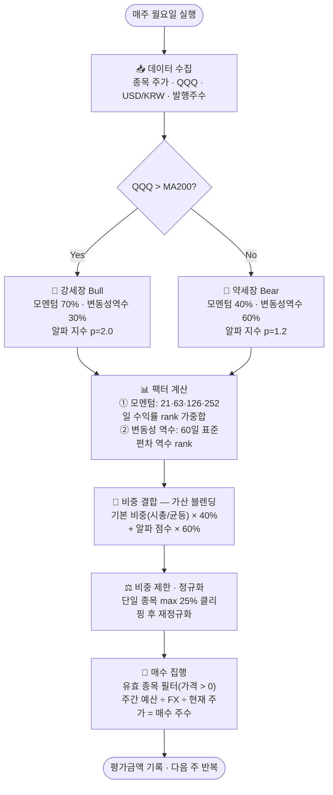

# Quant Portfolio Manager

> **팩터 가중 모멘텀 전략 기반의 주간 적립식 퀀트 포트폴리오 매니저**  
> 기관 펀드매니저가 사용하는 계량 투자 방법론을 개인 투자자도 쉽게 활용할 수 있도록 구현했습니다.

---

## 목차

1. [이 앱이 하는 일](#이-앱이-하는-일)
2. [전략 알고리즘](#전략-알고리즘)
3. [탭 기능 안내](#탭-기능-안내)
4. [백테스트 주의사항](#백테스트-주의사항)
5. [인증 & 데이터 저장](#인증--데이터-저장)
6. [프로젝트 구조](#프로젝트-구조)
7. [로컬 실행](#로컬-실행)
8. [배포](#배포)
9. [Dependencies](#dependencies)
10. [Changelog](#changelog)

---

## 이 앱이 하는 일

매주 정해진 금액(예: 50만 원)을 포트폴리오 종목들에 **어떻게 나눠서 살지** 자동으로 계산합니다.

단순 균등 배분이 아니라, 두 가지 질문에 답하면서 비중을 결정합니다.

> "지금 이 종목이 시장에서 얼마나 잘 달리고 있나?" → **모멘텀 점수**  
> "지금 이 종목이 얼마나 출렁거리고 있나?" → **변동성 역수 점수**

Bull / Bear 국면에 따라 두 점수의 비율을 다르게 섞어 최종 매수 금액을 결정합니다.

---

## 전략 알고리즘

### 흐름도



---

### 팩터 상세

#### 모멘텀 점수

수익률 자체가 아닌 **Rank(백분위)** 를 사용해 종목 간 공정 비교 및 outlier 영향을 최소화합니다.

| 기간 | 거래일 | 가중치 |
|------|--------|--------|
| 단기 | 21일 (1개월) | 10% |
| 중단기 | 63일 (3개월) | 20% |
| 중기 | 126일 (6개월) | 30% |
| 장기 | 252일 (12개월) | 40% |

```
momentum_score = Σ(기간별 수익률 rank × 가중치)
```

#### 변동성 역수 점수

60일 일간 수익률 표준편차의 역수를 rank화합니다. 덜 출렁일수록 높은 점수.

```
vol_inv_score = rank(1 / std(일간수익률, 60일))
```

> 변동성 0 또는 NaN 종목은 최대 변동성으로 패널티 처리합니다.

#### 국면별 팩터 배합

| 국면 | 모멘텀 가중 | 변동성역수 가중 | 알파 지수(모멘텀) |
|------|------------|--------------|----------------|
| 🐂 Bull | 70% | 30% | 2.0 |
| 🐻 Bear | 40% | 60% | 1.2 |

#### 기본 비중 + 알파 블렌딩

```
alpha_score = (momentum × m_weight) + (vol_inv × v_weight)
alpha_norm  = alpha_score / sum(alpha_score)

w_base      = 시총 가중  또는  균등 가중  (토글 선택)

w_combined  = w_base × 40% + alpha_norm × 60%   # 가산 블렌딩
w_final     = clip(w_combined, max=25%) → 재정규화
```

> **가산 블렌딩 채택 이유**: 이전 곱셈 방식(`w_base × alpha_score`)은 0~1 rank 기반 알파 스코어가 시총 정보를 희석시켜 시총/균등 토글의 차이가 거의 사라지는 버그가 있었습니다. 가산 블렌딩으로 교체 후 두 모드 간 평균 ~2.95%p의 비중 차이가 정상적으로 반영됩니다.

---

### 전략 철학

**DCA + 팩터 배분**: 매월 정액 투자의 규칙성은 유지하면서 매수 배분을 데이터 기반으로 최적화합니다.

**모멘텀 팩터**: 최근 6~12개월간 잘 오른 종목은 향후 3~6개월도 계속 오르는 경향이 있습니다 (Jegadeesh & Titman, 1993). 기업 펀더멘털 개선이 주가에 반영되는 속도 차이(정보 확산 지연)를 이용합니다.

**Low Volatility 팩터**: 덜 출렁이는 종목이 장기적으로 더 좋은 위험조정수익률을 냅니다. 특히 하락장에서 낙폭이 작아 원금 보전에 유리합니다.

**두 팩터를 섞는 이유**: 모멘텀은 강세장에서 강하지만 급락장에서 크게 손실납니다(Momentum Crash). Low Volatility는 하락장 방어에 탁월하지만 강세장에서는 시장에 뒤처집니다. 시장 국면에 따라 비율을 동적으로 조절하면 단독 팩터보다 안정적인 수익 곡선을 만들 수 있습니다.

---

## 탭 기능 안내

| 탭 | 기능 | 활용 시점 |
|----|------|----------|
| 📋 포트폴리오 | 종목 추가/삭제, 수량 인라인 편집, 실시간 시세 및 원화/달러 평가금액, 📸 증권사 캡처 이미지로 수량 자동 업데이트 | 매주 현황 확인 및 수량 업데이트 |
| 📡 AI 시그널 | 보유 종목 뉴스 Gemini AI 분석 (상승/하락/중립 카드), 뉴스·애널리스트·액션·AI 의견 4개 bullet | 투자 결정 전 뉴스 흐름 파악 |
| 🧮 매수 추천 | 팩터 알고리즘 기반 이번 주 매수 금액 추천, 시총/균등 가중 토글, 목표 비중 파이차트 | 매주 투자 실행 전 |
| 📈 백테스트 | 동일 전략 과거 시뮬레이션, XIRR 기준 성과 요약, 벤치마크(QQQM/XLK) 비교 | 전략 신뢰도 확인 |
| 🚨 매도 신호 | 최근 1달 일별 랭킹 분석, Top N 미진입 종목 자동 분류, heatmap | 정기 포트폴리오 점검 |
| ⚖️ 리밸런싱 | 현재 비중 vs 목표 비중 비교, 종목별 매도/매수 수량 및 금액 | 분기·반기 리밸런싱 |
| ⚙️ 설정 | 주간 투자금, 벤치마크, API 키 관리, 데이터 export/import | 초기 설정 또는 파라미터 변경 |

---

## 백테스트 주의사항

| # | 항목 | 내용 |
|---|------|------|
| ⚠️ 1 | Survivorship Bias | 현재 보유 종목(살아남은 종목)만으로 시뮬레이션 → 실제보다 성과 과대평가 가능 |
| ⚠️ 2 | 시총 근사 오차 | `현재 발행주수 × 과거 주가`로 시총 근사 → 자사주 매입·유상증자 오차 일부 잔존 |
| ⚠️ 3 | XIRR 사용 | CAGR은 전액 첫날 투자 가정 → 적립식 현실 반영을 위해 XIRR(내부수익률) 사용 |
| ⚠️ 4 | Look-ahead bias | 루프 내 슬라이스 후 ffill로 미래 가격 역류 차단, 워밍업 버퍼 420 달력일 확보 |

---

## 인증 & 데이터 저장

### Google Login (OIDC)

```
앱 접속 → Google 로그인 → 이메일 기반 포트폴리오 자동 로드
```

### 데이터 저장 (Supabase)

포트폴리오와 설정값은 Supabase에 저장됩니다. Streamlit Cloud 재시작 시에도 데이터가 유지됩니다.

```
로그인 이메일 → SHA-256 해시(16자) → Supabase portfolios 테이블
```

### API Key 보안

Gemini / Finnhub API 키는 암호화되어 Supabase에 저장됩니다. 관리자도 원문을 확인할 수 없습니다.

---

## 프로젝트 구조

```
quant_portfolio_web/
├── app.py                      # 진입점 — 탭 구성 및 라우팅
├── requirements.txt
├── assets/
│   └── icon.png
├── core/
│   ├── data.py                 # 시세/환율 수집 (yfinance wrapper)
│   ├── portfolio.py            # 포트폴리오 저장/로드 (Supabase / local JSON fallback)
│   ├── secrets_store.py        # API 키 암호화 저장/로드 (Supabase)
│   └── strategy.py             # 팩터 전략 · 매수 추천 · 백테스트 · XIRR
├── tabs/
│   ├── tab_portfolio.py
│   ├── tab_ai_signal.py
│   ├── tab_buyrec.py
│   ├── tab_backtest.py
│   ├── tab_sell_signal.py
│   ├── tab_rebalance.py
│   └── tab_settings.py
└── utils/
    ├── ai_client.py            # Gemini API + Finnhub data fetcher
    └── styles.py               # Global CSS
```

---

## 로컬 실행

```bash
git clone https://github.com/mavro7910/quant_portfolio_web.git
cd quant_portfolio_web
pip install -r requirements.txt
```

`.streamlit/secrets.toml` 설정:

```toml
SUPABASE_URL = "https://xxxx.supabase.co"
SUPABASE_KEY = "eyJhbGci..."
ES = "random_string_32chars_or_more"

[auth]
redirect_uri = "http://localhost:8501/oauth2callback"
cookie_secret = "random_string_32chars_or_more"

[auth.google]
client_id     = "xxxx.apps.googleusercontent.com"
client_secret = "GOCSPX-xxxx"
server_metadata_url = "https://accounts.google.com/.well-known/openid-configuration"
```

```bash
streamlit run app.py
```

Secret 생성:
```bash
python -c "import secrets; print(secrets.token_urlsafe(32))"
```

> Google Cloud Console → OAuth 클라이언트 → Authorized redirect URIs에 `http://localhost:8501/oauth2callback` 추가 필요

---

## Supabase 테이블

```sql
create table portfolios (
    uid        text primary key,
    data       jsonb not null,
    updated_at timestamp with time zone default now()
);

create table user_secrets (
    uid        text primary key,
    s          text not null,
    updated_at timestamp with time zone default now()
);

create table signal_cache (
    uid        text,
    cache_date text,
    data       jsonb not null,
    updated_at timestamp with time zone default now(),
    primary key (uid, cache_date)
);
```

---

## 배포

### Streamlit Community Cloud (무료)

1. GitHub에 push
2. [share.streamlit.io](https://share.streamlit.io) → **New app** → `app.py` → **Deploy**
3. **Settings → Secrets** 에 아래 내용 입력:

```toml
SUPABASE_URL = "https://xxxx.supabase.co"
SUPABASE_KEY = "eyJhbGci..."
ES = "random_string_32chars_or_more"

[auth]
redirect_uri = "https://YOUR_APP.streamlit.app/oauth2callback"
cookie_secret = "random_string_32chars_or_more"

[auth.google]
client_id     = "xxxx.apps.googleusercontent.com"
client_secret = "GOCSPX-xxxx"
server_metadata_url = "https://accounts.google.com/.well-known/openid-configuration"
```

4. Google Cloud Console → Authorized redirect URIs에 `https://YOUR_APP.streamlit.app/oauth2callback` 추가

---

## Dependencies

| Package | Version | 용도 |
|---------|---------|------|
| `streamlit` | ≥ 1.45.0 | Web framework |
| `authlib` | ≥ 1.3.2 | Google OAuth OIDC |
| `yfinance` | ≥ 1.2.0 | 시세/환율/뉴스 |
| `pandas` | ≥ 2.2.0, < 3.0 | 데이터 처리 |
| `numpy` | ≥ 1.26.0, < 2.1 | 수치 계산 |
| `plotly` | ≥ 5.22.0 | 차트 |
| `scipy` | ≥ 1.13.0 | XIRR (brentq) |
| `Pillow` | ≥ 10.3.0 | 앱 아이콘 |
| `requests` | ≥ 2.32.0 | HTTP |
| `supabase` | ≥ 2.0.0 | DB |
| `google-generativeai` | ≥ 0.8.0 | Gemini API |
| `cryptography` | ≥ 42.0.0 | API 키 암호화 |

---

## Changelog

### v2.2.0

- **[BUG FIX]** `target_weights()` 시총/균등 토글 차이 소멸 버그 수정
  - 기존 곱셈 방식(`w_base × alpha_score`)에서 **가산 블렌딩** (`w_base × 40% + alpha_norm × 60%`)으로 교체
  - 수정 후 두 모드 간 평균 ~2.95%p 비중 차이 정상 반영, 상관계수 0.80 수준
- **[BUG FIX]** `_calc_sharpe()` 내 `Invested` 재계산 불일치 수정
  - 고정값 `(i+1) × weekly_budget` → 포트폴리오 평가금액 `pct_change` 기반으로 통일
- **[개선]** 워밍업 버퍼 380일 → 420일 확대 (휴장일 여유 30일 추가)

### v2.1.0

- **[신규]** 📸 포트폴리오 캡처 이미지 업로드로 수량 자동 업데이트
  - Gemini Vision(1단계) + Gemini 텍스트 추론(2단계) 역할 분리
  - 한글 종목명 → 티커 변환 (포트폴리오 유니버스 내에서만 매핑)
  - 추출 결과 테이블 미리보기 — 티커·수량 수정 가능
  - 이미지에 없는 기존 종목 수량 0으로 초기화 (반영 전 경고 표시)
  - 여러 장 동시 업로드 지원, 중복 티커 자동 제거
- **[신규]** 총 평가금액 USD 메트릭 카드 추가
- **[개선]** AI 시그널 카드 — 4번째 bullet에 "AI 의견" 라벨 추가
- **[개선]** Marketaux API 키 지원 추가
- **[개선]** 앱 시작 시 모든 API 키 자동 로드
- **[BUG FIX]** signal_cache UTC/KST 날짜 불일치 버그 수정
- **[BUG FIX]** Gemini 배치 응답 중첩 리스트 파싱 오류 방어 처리

### v2.0.0

- **[신규]** 프로젝트 구조 리팩토링 — `app.py` 단일 파일 → `tabs/` + `utils/` 모듈 분리
- **[신규]** `📡 AI 시그널` 탭 (Gemini + Finnhub + Marketaux)
- **[신규]** `core/secrets_store.py` — API 키 암호화 저장/로드
- **[신규]** Supabase 연동 강화

### v1.7.0

- **[신규]** Google OAuth(OIDC) 전환 — 멀티 디바이스 지원

### v1.6.0

- **[신규]** 매도 신호 탭, CAGR → XIRR 교체

### v1.4.0

- **[신규]** 리밸런싱 탭, 포트폴리오 인라인 수량 편집

### v1.2.0

- **[BUG FIX]** 백테스트 시총 look-ahead bias 개선, XIRR 계산 추가

---

## References

- Jegadeesh, N. & Titman, S. (1993). *Returns to Buying Winners and Selling Losers.* Journal of Finance.
- Asness, C., Moskowitz, T., & Pedersen, L. (2013). *Value and Momentum Everywhere.* Journal of Finance.
- Baker, M. & Haugen, R. (2012). *Low Risk Stocks Outperform within All Observable Markets.* SSRN.
- Antonacci, G. (2014). *Dual Momentum Investing.* McGraw-Hill.

---

## 면책 고지

이 앱은 정보 제공 및 교육 목적으로 제작되었습니다. 특정 종목이나 투자에 대한 매수/매도를 권유하지 않습니다. 모든 투자 결정은 본인의 판단과 책임 하에 이루어져야 하며, 과거 백테스트 성과가 미래 수익을 보장하지 않습니다.

---

MIT License
